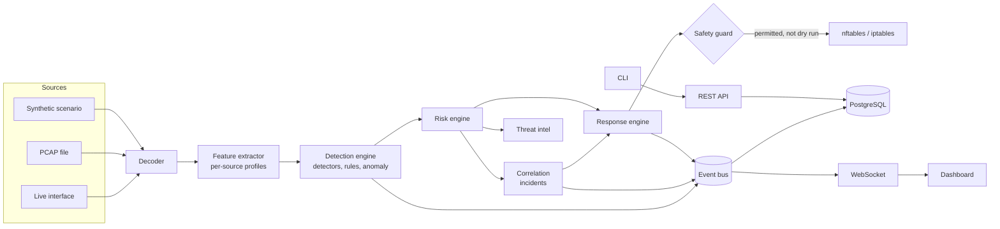

# SentinelX

SentinelX is an open-source network intrusion detection and prevention platform. It captures traffic (live or from PCAP files), decodes it, detects scans, brute force, floods, DNS abuse and custom rule matches, and scores each finding from 0 to 100 with the reasons shown. It correlates related findings into incidents and, only when you enable it, blocks or rate-limits attackers through nftables or iptables behind a safety guard.

Every alert shows its work: the evidence that triggered it, the thresholds it crossed, how its risk score was built, and what the response engine decided and why.

> **Status: alpha (0.1.0).** SentinelX is tested (unit, integration, API and end-to-end replay tests; PostgreSQL and Redis in CI) and benchmarked on synthetic traffic, but it has not been proven in production networks. It runs in **detection-only, dry-run mode by default** and never changes a firewall until an administrator enables prevention. Read [Limitations](#limitations) before deploying it.

## Contents

- [Features](#features)
- [Architecture](#architecture)
- [Installation](#installation)
- [Quick start](#quick-start)
- [Running the platform](#running-the-platform)
- [Live capture](#live-capture)
- [CLI](#cli)
- [Dashboard](#dashboard)
- [Detection engine](#detection-engine)
- [Writing rules](#writing-rules)
- [Risk scoring and incidents](#risk-scoring-and-incidents)
- [Prevention mode](#prevention-mode)
- [PCAP replay](#pcap-replay)
- [API](#api)
- [Docker](#docker)
- [Development and testing](#development-and-testing)
- [Benchmarks](#benchmarks)
- [Security](#security)
- [Limitations](#limitations)
- [Documentation](#documentation)
- [Author](#author)
- [License](#license)

## Features

**Capture and decoding**
- Live capture on Linux through `AF_PACKET` with kernel BPF filters (Scapy fallback), PCAP and PCAPNG replay, and synthetic scenarios.
- `struct`-based decoders for Ethernet, IPv4, IPv6, ARP, TCP, UDP and ICMP, plus DNS, HTTP request metadata and TLS ClientHello metadata (SNI, ALPN). Malformed packets are counted, never fatal.

**Detection**
- Built-in detectors: TCP vertical port scans, horizontal sweeps, UDP scans, SSH and other service brute force, SYN floods, connection-rate floods, ICMP floods, HTTP floods, DNS tunnelling and query floods, denylisted sources, and TCP flag anomalies.
- Statistical anomaly detection against per-source baselines, resistant to slow baseline poisoning, and an optional Isolation Forest model trained on your own traffic.
- A YAML rule language with a safe, bounded condition parser (no `eval`), embedded rule tests, and a rule editor in the dashboard.
- Every detection carries structured evidence and a plain-language explanation.

**Analysis and response**
- A configurable, additive 0–100 risk score with stored contributions.
- Correlation of detections into incidents using kill-chain patterns (for example, reconnaissance followed by credential attacks).
- Offline-first threat intelligence: local denylist and allowlist files, plus an optional HTTPS reputation provider.
- A response engine with detect-only, manual-approval and automatic modes, dry run, temporary blocks with kernel-side expiry, rate limiting and webhooks.
- A safety guard that refuses to block loopback, allowlisted and management addresses, the sensor's own addresses, and oversized prefixes.

**Platform**
- A FastAPI REST API at `/api/v1` with OpenAPI, and a WebSocket event stream at `/api/v1/ws/events`.
- Admin, analyst and viewer roles; Argon2id passwords; short-lived JWTs with refresh rotation; httpOnly cookies with CSRF protection; and an audit log.
- PostgreSQL storage (SQLite for evaluation) with Alembic migrations and retention; Redis for shared rate limits and state, with a degraded mode when it is unavailable.
- Prometheus metrics, a Typer CLI with interactive menus and scriptable JSON output, and a Next.js dashboard.
- A reproducible benchmark harness that reports detection rate, false positives, time to detect, latency and throughput, including known evasions.

## Architecture

SentinelX is a modular monolith. The security core (capture, decoding, detection, scoring, correlation, response) is plain Python with no web dependencies. One composition root, `Platform`, wires it to storage, Redis and the event bus, and both the API server and the CLI use it.



Repository layout:

| Path | Contents |
|---|---|
| `packages/sentinelx/` | The Python package: `capture`, `parser`, `features`, `detection`, `signatures` (rules), `anomaly`, `scoring`, `correlation`, `threat_intel`, `response`, `firewall`, `storage`, `services`, `api`, `cli`, `bench`, `testing` |
| `apps/dashboard/` | Next.js dashboard |
| `rules/` | Shipped YAML rules and local threat-intel lists |
| `tests/` | Unit, capture, detection, response, integration and API tests |
| `scripts/` | Benchmark, OpenAPI export, development seed data |
| `docker/`, `docker-compose.yml` | Container images and the compose stack |
| `benchmarks/results/` | Generated benchmark reports |
| `docs/` | Detailed documentation |

Details: [docs/architecture.md](docs/architecture.md).

## Installation

Requirements:

- Linux for live capture and firewall enforcement. Offline analysis, the API and the dashboard also run on macOS.
- Python 3.12 or newer.
- Node.js 20.9 or newer, for the dashboard.
- Optional: PostgreSQL 15+ and Redis 7+. Without them SentinelX uses SQLite and in-process state, which is fine for evaluation but not for production.
- Optional: `nftables` (preferred) or `iptables`, for prevention.

```bash
git clone <repository-url> sentinelx
cd sentinelx
make install          # creates .venv, installs the backend with dev tools and the dashboard, copies .env.example to .env
source .venv/bin/activate
sentinelx doctor      # checks Python, privileges, database, Redis, firewall tooling and configuration
```

Without `make`:

```bash
python3 -m venv .venv && .venv/bin/pip install -e ".[dev]"
cd apps/dashboard && npm ci
```

## Quick start

No privileges or network access are needed. Generate synthetic attack captures and run one through the same pipeline that live capture uses:

```bash
sentinelx fixtures generate --output pcaps/fixtures
sentinelx replay pcaps/fixtures/mixed_intrusion.pcap
```

The replay prints every detection with its severity, risk score, source, detector and the response that would have been taken, followed by correlated incidents. For the mixed intrusion capture, that includes a TCP port scan, an SSH brute force and an ICMP flood from `203.0.113.200`, correlated into a "Potential host compromise attempt" incident with a breakdown of its score. Replays never change the firewall.

Useful variations:

```bash
sentinelx replay pcaps/fixtures/tcp_port_scan.pcap --json          # machine-readable
sentinelx replay pcaps/fixtures/ssh_brute_force.pcap --persist     # store results for the dashboard
sentinelx monitor --scenario mixed_intrusion                       # live terminal view, no privileges
sentinelx fixtures list                                            # every scenario
```

## Running the platform

```bash
make dev       # API on 127.0.0.1:8000 and dashboard on http://localhost:3000, with reload
```

Or separately:

```bash
sentinelx start                  # API, WebSocket and pipeline (no live capture)
cd apps/dashboard && SENTINELX_API_URL=http://127.0.0.1:8000 npm run dev
```

On first start with an empty user table, SentinelX creates an `admin` account. If `API__BOOTSTRAP_ADMIN_PASSWORD` is not set, a password is generated and printed **once** to the server's standard error, and you must change it at first sign-in. It is never written to the log.

Load example data into a development database:

```bash
make seed      # refuses to run with ENVIRONMENT=production
```

Configuration comes from environment variables or `.env`. See [.env.example](.env.example) and the full reference in [docs/deployment.md](docs/deployment.md).

## Live capture

Live capture needs `CAP_NET_RAW`. Check your interfaces and privileges first:

```bash
sentinelx interfaces
sentinelx doctor
```

Then either run as root, or grant the capability to the virtual environment's interpreter (this affects every script run with it):

```bash
sudo setcap cap_net_raw,cap_net_admin+eip "$(readlink -f .venv/bin/python)"
```

Start capturing:

```bash
sentinelx start --capture --interface eth0              # full platform
sentinelx monitor --interface eth0 --bpf 'tcp or udp'   # terminal view only
```

`CAPTURE_INTERFACE` and `BPF_FILTER` set the defaults. Details, privileges and troubleshooting: [docs/packet-capture.md](docs/packet-capture.md).

## CLI

Run `sentinelx` with no arguments for a numbered menu, or use subcommands directly. Most listing commands accept `--json`, and every command has `--help`.

| Group | Commands |
|---|---|
| Operate | `start`, `status`, `interfaces`, `metrics`, `doctor`, `version`, `db upgrade/current/purge`, `users list/create/reset-password` |
| Investigate | `detections` (`--id` to explain one), `incidents`, `threats` |
| Respond | `blocked`, `block`, `unblock` |
| Lab | `replay`, `monitor`, `fixtures list/generate`, `anomaly train` |
| Configure | `rules list/validate/test/enable/disable/fields`, `config show/set` |

Examples:

```bash
sentinelx detections --id <detection-id>                 # evidence, explanation and score breakdown
sentinelx block 198.51.100.7 --duration 900 --reason "confirmed scanner"
sentinelx rules test rules                               # run every rule's embedded tests
sentinelx config show
```

Exit codes: `0` success, `1` failure, `2` invalid usage or configuration, `130` interrupted.

## Dashboard

The dashboard is a Next.js application that talks to the API through a same-origin proxy, so session cookies stay `SameSite=Strict` and CORS stays closed.

| Page | Purpose |
|---|---|
| Overview | Current posture, detection timeline, top threats and recent detections |
| Live monitor | Streaming detections, incidents and response decisions, with filters |
| Threats | Sources ranked by risk, with their detections |
| Incidents | Correlated incidents, triage status, notes and member detections |
| Detections | Evidence, explanation and risk breakdown for a single detection |
| Network | Protocols, services, talkers and traffic volume |
| Analytics | Detection trends by category, severity and detector |
| Rules | Rule list, editor with validation, and testing against scenarios or captures |
| Firewall | Active blocks, pending approvals, block and unblock with a safety preview |
| PCAP Lab | Upload captures, generate scenarios, run and compare replays |
| Audit | Security-relevant actions with actor and outcome |
| Settings | Health, response mode (with a typed confirmation to enable prevention), detection thresholds and users |

Press `Ctrl+K` to search: an IP address opens that source's threats, and a detection or incident ID opens it directly.

## Detection engine

Detectors consume per-source behavioural profiles built by the feature extractor, using constant-time sliding windows so an attacker cannot slow the sensor by filling them. The engine applies the allowlist first, isolates detector failures, suppresses duplicates with a cooldown while still reporting escalation, and rejects detections without evidence.

Thresholds are configurable, for example:

```bash
DETECTION__PORT_SCAN_UNIQUE_PORTS=20        # distinct ports from one source...
DETECTION__PORT_SCAN_WINDOW_SECONDS=15      # ...within this window
DETECTION__BRUTE_FORCE_ATTEMPTS=15
DETECTION_MODE=balanced                     # disabled | signature_only | balanced | aggressive
```

Every detector, its signals, settings and known evasions: [docs/detection-engine.md](docs/detection-engine.md).

## Writing rules

Rules are YAML files in `rules/`. The condition language supports comparisons, boolean logic, lists and windowed counts. It is parsed by a bounded recursive-descent parser, never evaluated as code.

A shipped rule, from `rules/authentication.yml`:

```yaml
rules:
  - name: SSH Brute Force
    description: Repeated short-lived SSH sessions from one source, the pattern of automated password guessing.
    condition: protocol == TCP and destination_port == 22 and short_sessions >= 20
    within: 60s
    severity: high
    category: brute_force
    confidence: 0.85
    action: temporary_block
    duration: 900
    tags: [ssh, t1110]
    tests:
      - scenario: ssh_brute_force
        expect: match
      - scenario: ssh_brute_force
        params: {attempts: 10}
        expect: no_match
      - scenario: normal_traffic
        expect: no_match
```

Validate and test rules:

```bash
sentinelx rules fields              # every field a condition can use
sentinelx rules validate
sentinelx rules test rules
```

A rule whose action blocks or rate-limits must include a count threshold of at least 2 on every branch of its condition, so a rule that matches a single packet cannot block anyone. Full grammar and field reference: [docs/rule-engine.md](docs/rule-engine.md).

## Risk scoring and incidents

Each detection's risk score adds weighted contributions from severity, confidence, recent frequency, the source's history, correlation with other detections, threat intelligence, target sensitivity and previous responses, minus a penalty for allowlisted sources, capped to 0–100. Each contribution is stored with its reason, and every weight is configurable (`SCORING__SEVERITY_WEIGHT`, `SCORING__INTEL_WEIGHT` and so on). For example, a synthetic TCP port scan scored 66.6: severity 45, confidence 19.6, frequency 2.

The correlation engine groups detections from the same source within a window (default 600 seconds) and matches kill-chain patterns to raise incidents. A single detection above the standalone threshold (default 85) opens an incident by itself.

Details and tuning: [docs/risk-scoring.md](docs/risk-scoring.md).

## Prevention mode

Out of the box SentinelX is in **detection-only mode with dry run enabled**, and the firewall backend is `null`. It explains what it would do but does nothing to traffic.

| Setting | Values | Default |
|---|---|---|
| `RESPONSE_MODE` | `detect_only`, `manual_approval`, `automatic` | `detect_only` |
| `DRY_RUN` | `true`, `false` | `true` |
| `FIREWALL_BACKEND` | `null`, `nftables`, `iptables` | `null` |

A safe path to enforcement:

1. Add your management addresses, jump hosts, gateways and critical servers to the allowlist.
2. Set `FIREWALL_BACKEND=nftables`, `RESPONSE_MODE=manual_approval` and keep `DRY_RUN=true`. Review the decisions the engine proposes in the Firewall page.
3. Set `DRY_RUN=false` so that approved actions are applied. Approve actions individually.
4. Only then consider `automatic`, with a high `SCORING__AUTO_BLOCK_THRESHOLD` (default 85) and short temporary blocks.

Enabling prevention from the dashboard requires typing `ENABLE PREVENTION`, and the change is audited. Whatever the mode, the safety guard refuses to block loopback, allowlisted, management and local addresses, and prefixes larger than a /24 by default.

> **Warning:** a block applied on the wrong address can cut off your own access to the host. Test in `manual_approval` mode first. SentinelX's nftables rules live in their own `sentinelx` table, so removing that table removes every SentinelX block.

Details: [docs/response-engine.md](docs/response-engine.md).

## PCAP replay

The PCAP Lab (CLI, API and dashboard) runs captures through an isolated copy of the pipeline that is forced into dry run with an in-memory firewall, so a replay can never touch the real firewall. Uploaded files are size-limited and checked for a PCAP or PCAPNG signature. Replays can be stored and tagged with a replay ID for review in the dashboard.

```bash
sentinelx replay capture.pcapng --speed 1 --persist --report report.json
sentinelx rules test rules/authentication.yml --pcap capture.pcapng   # test rules against a capture
```

Details: [docs/pcap-lab.md](docs/pcap-lab.md).

## API

- REST API under `/api/v1`, with an OpenAPI document and interactive docs in non-production environments.
- Scripts authenticate with `POST /api/v1/auth/login` and a bearer token. The dashboard uses httpOnly cookies and a CSRF header.
- The live event stream is at `/api/v1/ws/events`, authenticated with a single-use ticket.
- Prometheus metrics are served to loopback clients, or to any client with `API__METRICS_TOKEN`.

```bash
TOKEN=$(curl -s -X POST http://127.0.0.1:8000/api/v1/auth/login \
  -H 'Content-Type: application/json' \
  -d '{"username":"admin","password":"<password>"}' | jq -r .access_token)
curl -s -H "Authorization: Bearer $TOKEN" http://127.0.0.1:8000/api/v1/detections | jq
```

Endpoint reference, roles and event types: [docs/api.md](docs/api.md).

## Docker

```bash
cp .env.example .env     # set POSTGRES_PASSWORD, REDIS_PASSWORD and a 32+ character JWT_SECRET
docker compose up -d     # postgres, redis, migrate, api, dashboard
```

The dashboard is published on `http://127.0.0.1:3000`, and the API on `127.0.0.1:8000`. All ports are bound to loopback by default.

**A container on a Docker bridge network sees only its own traffic.** The default stack is suitable for PCAP analysis, the API and the dashboard, but not for monitoring your network. For live capture, use the `capture` profile, which runs the sensor with host networking and the `NET_RAW` and `NET_ADMIN` capabilities:

```bash
docker compose --profile capture up -d
```

Details, bare-metal installation and a production checklist: [docs/deployment.md](docs/deployment.md).

## Development and testing

```bash
make test               # full test suite on SQLite, no external services
make test-integration   # the same suite against real PostgreSQL and Redis containers
make lint               # ruff (check and format) and dashboard ESLint
make typecheck          # mypy --strict and TypeScript
make rules              # validate rules and run their embedded tests
make openapi            # regenerate the dashboard's typed API contract
make check              # lint, typecheck, test, rules and a dashboard production build
```

CI runs all of these, checks that migrations match the models and that the committed OpenAPI contract has not drifted, builds the dashboard, and builds both container images. See [docs/contributing.md](docs/contributing.md).

## Benchmarks

`make benchmark` runs synthetic attack scenarios with known ground truth through the production pipeline and writes a timestamped report to `benchmarks/results/`. The most recent run (Intel Core i5-8350U laptop, Python 3.14.6, 5 runs per experiment, default thresholds) measured:

- 100% detection with no false positives on 13 synthetic attack experiments and 6,000 packets of benign traffic.
- 0% detection on the two deliberate evasion experiments: a slow port scan (one probe every 1.2 s) and a low-rate brute force (one attempt every 8 s). This is expected with default thresholds.
- Time to detect ranged from 0.22 s of attack traffic (port scan) to 7.5 s (SSH brute force).
- Throughput was about 2,900–4,600 packets per second on one core, with 0.4–0.8 ms processing latency per detection and about 120 MB resident memory.
- The decoder was about 2× faster than Scapy on the same frames.

These are synthetic scenarios designed to exceed the default thresholds. They show the pipeline works end to end; they are not a measure of real-world accuracy. Full results, method and caveats: [docs/benchmarking.md](docs/benchmarking.md).

## Security

- Defaults are safe: detection only, dry run, no firewall backend.
- Production mode refuses a weak `JWT_SECRET`, disabled authentication, wildcard CORS and SQLite.
- Firewall commands run as argument vectors, never through a shell, and only after safety-guard validation.
- Secrets are redacted from every log record.

Threat model and controls: [docs/security.md](docs/security.md). To report a vulnerability, see [SECURITY.md](SECURITY.md).

## Limitations

- **Throughput.** A single Python process handles thousands of packets per second, not millions. SentinelX suits home and lab networks, small offices, targeted segments via BPF filters, and offline analysis. It does not replace Suricata or Zeek on high-speed links.
- **Threshold detectors are evadable.** Slow and distributed attacks can stay under per-source thresholds, as the benchmark's evasion experiments show.
- **Encrypted traffic.** Only metadata is inspected (flows, DNS, TLS SNI and ALPN). There is no TLS decryption or payload signature matching in the style of Snort or Suricata.
- **Single sensor state.** Detection state lives in the sensor process. Several sensors can share one database and Redis, but they do not share detection windows.
- **Spoofed sources.** Blocking on source address can be abused with spoofed traffic. Prefer rate limits and short temporary blocks for floods.
- **Linux enforcement only.** Prevention uses nftables or iptables.
- **No MFA or SSO.** Put the dashboard behind a VPN or an authenticating reverse proxy if it must be reachable beyond a trusted network.
- **Not yet production-proven.** Test in your environment in detection-only mode before relying on it.

## Documentation

| Document | Topic |
|---|---|
| [architecture.md](docs/architecture.md) | Components, data flow and design decisions |
| [packet-capture.md](docs/packet-capture.md) | Capture sources, privileges and decoders |
| [detection-engine.md](docs/detection-engine.md) | Detectors, thresholds, anomaly detection and evasions |
| [rule-engine.md](docs/rule-engine.md) | Rule format, condition grammar and field reference |
| [risk-scoring.md](docs/risk-scoring.md) | Risk model, correlation and threat intelligence |
| [response-engine.md](docs/response-engine.md) | Response modes, safety guard and firewall adapters |
| [api.md](docs/api.md) | REST and WebSocket reference |
| [deployment.md](docs/deployment.md) | Docker, bare metal, configuration and hardening |
| [pcap-lab.md](docs/pcap-lab.md) | Offline analysis and replays |
| [benchmarking.md](docs/benchmarking.md) | Method, results and caveats |
| [contributing.md](docs/contributing.md) | Development workflow and conventions |
| [security.md](docs/security.md) | Threat model and controls |

## Author

SentinelX is designed and built by **Oluwayemi Oyinlola Michael**.

- Portfolio: [oyinlola1.vercel.app](https://oyinlola1.vercel.app)

## License

Copyright 2026 Oluwayemi Oyinlola Michael. Licensed under the Apache License 2.0; see [LICENSE](LICENSE) and [NOTICE](NOTICE).
