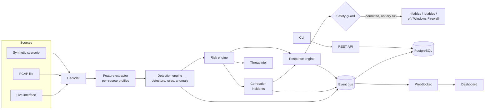

# SentinelX

SentinelX is an open-source network intrusion detection and prevention platform. It captures traffic (live or from PCAP files), decodes it, detects scans, brute force, floods, DNS abuse and custom rule matches, and scores each finding from 0 to 100 with the reasons shown. It correlates related findings into incidents and, only when you enable it, blocks or rate-limits attackers through the host firewall behind a safety guard.

Every alert shows its work: the evidence that triggered it, the thresholds it crossed, how its risk score was built, and what the response engine decided and why.

> **Status: alpha (0.1.0).** SentinelX is tested (unit, integration, API, end-to-end replay tests, and kernel tests of live capture and firewall changes in a network namespace; PostgreSQL and Redis in CI) and benchmarked on synthetic traffic, but it has not been proven in production networks. It has been run on Linux x86_64 only; see [Platform support](#platform-support). It runs in **detection-only, dry-run mode by default** and never changes a firewall until an administrator enables prevention. Read [Limitations](#limitations) before deploying it.

## Contents

- [Features](#features)
- [Architecture](#architecture)
- [Platform support](#platform-support)
- [Installation](#installation)
- [Quick start](#quick-start)
- [Running the platform](#running-the-platform)
- [Live capture](#live-capture)
- [CLI](#cli)
- [Dashboard](#dashboard)
- [Detection engine](#detection-engine)
- [Writing rules](#writing-rules)
- [Risk scoring and incidents](#risk-scoring-and-incidents)
- [Prevention mode](#prevention-mode)
- [PCAP replay](#pcap-replay)
- [API](#api)
- [Docker](#docker)
- [Development and testing](#development-and-testing)
- [Benchmarks](#benchmarks)
- [Security](#security)
- [Limitations](#limitations)
- [Documentation](#documentation)
- [Author](#author)
- [License](#license)

## Features

**Capture and decoding**
- Live capture through `AF_PACKET` on Linux, or libpcap through Scapy (BPF devices on macOS, Npcap on Windows, and as a fallback on Linux). PCAP and PCAPNG replay, and synthetic scenarios.
- Capture problems are reported as they are: a permission error, an unknown interface or an invalid BPF filter is never hidden by falling back to another backend.
- `struct`-based decoders for Ethernet, IPv4, IPv6, ARP, TCP, UDP and ICMP, plus DNS, HTTP request metadata and TLS ClientHello metadata (SNI, ALPN). Malformed packets are counted, never fatal.

**Detection**
- Built-in detectors: TCP vertical port scans, horizontal sweeps, UDP scans, SSH and other service brute force, SYN floods, connection-rate floods, ICMP floods, HTTP floods, DNS tunnelling and query floods, denylisted sources, and TCP flag anomalies.
- Statistical anomaly detection against per-source baselines, resistant to slow baseline poisoning, and an optional Isolation Forest model trained on your own traffic (needs the `ml` extra).
- A YAML rule language with a safe, bounded condition parser (no `eval`), embedded rule tests, and a rule editor in the dashboard.
- Every detection carries structured evidence and a plain-language explanation.

**Analysis and response**
- A configurable, additive 0–100 risk score with stored contributions.
- Correlation of detections into incidents using kill-chain patterns (for example, reconnaissance followed by credential attacks).
- Offline-first threat intelligence: local denylist and allowlist files, plus an optional HTTPS reputation provider.
- A response engine with detect-only, manual-approval and automatic modes, dry run, temporary blocks, rate limiting (nftables and iptables) and HTTPS webhooks.
- Firewall adapters for nftables, iptables, pf and Windows Firewall. nftables expires temporary blocks in the kernel; the other adapters rely on SentinelX's expiry task, which restores deadlines from the database after a restart.
- A safety guard that refuses to block loopback, allowlisted and management addresses, the host's own addresses, operators signed in within the last hour, and oversized prefixes.

**Platform**
- A capability report (`sentinelx capabilities`, `GET /api/v1/system/capabilities`, Settings page) that probes what this host can actually do: replay, interface enumeration, live capture, firewall control and automatic blocking, each with the reason and the remedy.
- A FastAPI REST API at `/api/v1` with OpenAPI, and a WebSocket event stream at `/api/v1/ws/events`.
- Admin, analyst and viewer roles; Argon2id passwords; short-lived JWTs with refresh rotation; httpOnly cookies with CSRF protection; and an audit log.
- PostgreSQL storage (SQLite for evaluation) with Alembic migrations and retention; Redis for shared rate limits and state, with a degraded mode when it is unavailable.
- Prometheus metrics, a Typer CLI with interactive menus and scriptable JSON output, and a Next.js dashboard.
- A reproducible benchmark harness that reports detection rate, false positives, time to detect, latency and throughput, including known evasions.

## Architecture

SentinelX is a modular monolith. The security core (capture, decoding, detection, scoring, correlation, response) is plain Python with no web dependencies. One composition root, `Platform`, wires it to storage, Redis and the event bus, and both the API server and the CLI use it.



Repository layout:

| Path | Contents |
|---|---|
| `packages/sentinelx/` | The Python package: `capture`, `parser`, `features`, `detection`, `signatures` (rules), `anomaly`, `scoring`, `correlation`, `threat_intel`, `response`, `firewall`, `system` (host and capability detection), `storage`, `services`, `api`, `cli`, `bench`, `testing` |
| `apps/dashboard/` | Next.js dashboard |
| `rules/` | Shipped YAML rules and local threat-intel lists |
| `tests/` | Unit, capture, detection, response, integration, API and kernel tests |
| `scripts/` | Benchmark, OpenAPI export, development seed data |
| `docker/`, `docker-compose.yml` | Container images, the front proxy configuration and the compose stack |
| `benchmarks/results/` | Generated benchmark reports |
| `docs/` | Detailed documentation |

Details: [docs/architecture.md](docs/architecture.md).

## Platform support

What has been run, and on what. "Implemented, unverified" means the code path exists and is unit-tested against recorded command output, but has not been run on that operating system.

| Platform | PCAP replay, detection, CLI, API, dashboard | Live capture | Firewall enforcement |
|---|---|---|---|
| Linux x86_64 (Kali with Python 3.14; Python 3.12 in `python:3.12-slim`) | Tested | Tested: `af_packet` and `libpcap` | Tested: nftables and iptables |
| Docker Compose on a Linux host | Tested: full stack end to end through the browser | Tested: `capture` profile on the host network | Tested: a real nftables block inside the API container |
| Linux ARM64 | Not yet verified | Not yet verified | Not yet verified |
| macOS | Expected to work, not yet verified | Implemented (libpcap, BPF devices), unverified | Implemented (pf), unverified |
| Windows | Expected to work, not yet verified | Implemented (Npcap), unverified | Implemented (Windows Firewall), unverified |
| WSL2 | Expected to work, not yet verified | Sees the WSL virtual machine, not the Windows host | Changes the WSL virtual machine, not the Windows host |
| Docker Desktop (macOS, Windows) | Expected to work, not yet verified | Host networking reaches Docker's virtual machine, not your computer | Not applicable to the computer |

Live capture and nftables/iptables enforcement were verified against a real kernel in an isolated network namespace (`make test-kernel`) and inside a container. PCAP replay, detection, the CLI and the API contain no operating-system-specific code, but the test suite has not been run on macOS or Windows. Under WSL, `sentinelx capabilities` and `sentinelx doctor` say that capture and firewall changes apply to the virtual machine. For native macOS or Windows capture, install SentinelX natively rather than in Docker Desktop.

Full matrix and per-platform notes: [docs/deployment.md](docs/deployment.md#platform-support).

## Installation

Requirements:

- Python 3.12 or newer.
- Node.js 20.9 or newer, for the dashboard.
- Optional: PostgreSQL 15+ and Redis 7+. Without them SentinelX uses SQLite and in-process state, which is fine for evaluation but not for production.
- Optional, for live capture and prevention: see the platform notes below.

The lowest-barrier path needs no privileges, no capture library and no services. It installs the backend and replays synthetic attacks:

```bash
git clone <repository-url> sentinelx
cd sentinelx
python3 -m venv .venv
.venv/bin/pip install -e .
.venv/bin/sentinelx fixtures generate
.venv/bin/sentinelx replay pcaps/fixtures/mixed_intrusion.pcap
```

Optional extras:

```bash
.venv/bin/pip install -e ".[ml]"    # numpy and scikit-learn, for the Isolation Forest detector and `sentinelx anomaly train`
.venv/bin/pip install -e ".[dev]"   # pytest, mypy, ruff
```

Then check what this host can do, and whether the configuration is sound:

```bash
.venv/bin/sentinelx capabilities   # replay, interfaces, live capture, firewall, automatic blocking
.venv/bin/sentinelx doctor         # PASS, WARN, FAIL or INFO per check; exit status 1 on any FAIL
```

On a new install, `doctor` reports the SQLite database as PASS and the migrations check as WARN (SQLite databases are migrated automatically when SentinelX starts; `sentinelx db upgrade` migrates now), and warns that the API and dashboard are not running. `doctor` only inspects the database; it never migrates it.

### Linux

`make install` creates `.venv`, installs the backend with the `dev` and `ml` extras, runs `npm ci` for the dashboard and copies `.env.example` to `.env` if `.env` does not exist.

For live capture:

- Install libpcap (for example `libpcap0.8` on Debian, Ubuntu and Kali) if you use BPF filters, which are compiled with libpcap. Capture without a filter does not need it.
- Either run SentinelX as root, or grant the capabilities to the interpreter once:

  ```bash
  sudo setcap cap_net_raw,cap_net_admin=eip "$(readlink -f .venv/bin/python)"
  ```

  `CAP_NET_RAW` is for capture. `CAP_NET_ADMIN` is for firewall changes: SentinelX passes it to the `nft` or `iptables` commands it runs through Linux ambient capabilities. By default `.venv/bin/python` is a symbolic link, so this grants the capabilities to the system interpreter it points to, and to every program run with it. Create the environment with `python3 -m venv --copies .venv` if SentinelX should have its own interpreter binary.
- For prevention, install `nftables` (preferred) or `iptables`.

### macOS

```bash
python3 -m venv .venv
.venv/bin/pip install -e .
```

Live capture reads `/dev/bpf*` through libpcap. Run as root, or give your user access to the BPF devices (Wireshark's ChmodBPF launch daemon does this). The pf adapter needs root. It uses the anchor `com.apple/sentinelx` by default (`RESPONSE__PF_ANCHOR`), which the stock `/etc/pf.conf` evaluates. pf does not support SentinelX's rate limiting. None of this has been run on a real Mac yet.

### Windows

The Makefile needs bash, so use the plain commands in PowerShell:

```powershell
python -m venv .venv
.venv\Scripts\python -m pip install -e .
.venv\Scripts\sentinelx fixtures generate
.venv\Scripts\sentinelx replay pcaps\fixtures\mixed_intrusion.pcap
cd apps\dashboard; npm ci
```

Live capture needs [Npcap](https://npcap.com). If Npcap was installed with access restricted to Administrators, run SentinelX from an elevated terminal. The Windows Firewall adapter uses the PowerShell NetSecurity cmdlets and always needs an elevated terminal. It does not support rate limiting. None of this has been run on a real Windows host yet.

### Docker

See [Docker](#docker).

## Quick start

No privileges or network access are needed. Generate synthetic attack captures and run one through the same pipeline that live capture uses:

```bash
sentinelx fixtures generate --output pcaps/fixtures
sentinelx replay pcaps/fixtures/mixed_intrusion.pcap
```

The replay prints every detection with its severity, risk score, source, detector and the response that would have been taken, followed by correlated incidents. For the mixed intrusion capture, that includes a TCP port scan, an SSH brute force and an ICMP flood from `203.0.113.200`, correlated into a "Potential host compromise attempt" incident with a breakdown of its score. Replays never change the firewall.

Useful variations:

```bash
sentinelx replay pcaps/fixtures/tcp_port_scan.pcap --json          # machine-readable
sentinelx replay pcaps/fixtures/ssh_brute_force.pcap --persist     # store results for the dashboard
sentinelx monitor --scenario mixed_intrusion                       # live terminal view, no privileges
sentinelx fixtures list                                            # every scenario
```

## Running the platform

```bash
make dev       # API on 127.0.0.1:8000 and dashboard on http://localhost:3000, with reload
```

Or separately (on Windows, without `make`):

```bash
sentinelx start                  # API, WebSocket and pipeline (no live capture)
cd apps/dashboard && npm run dev # forwards /api to SENTINELX_API_URL, default http://127.0.0.1:8000
```

The dashboard server forwards `/api` requests, including the event stream, to the API, so the browser uses one origin.

On first start with an empty user table, SentinelX creates an `admin` account. If `API__BOOTSTRAP_ADMIN_PASSWORD` is not set, a password is generated and printed **once** to the server's standard error, and you must change it at first sign-in. It is never written to the log.

A SQLite database is created and migrated to the latest schema automatically at startup. PostgreSQL needs `sentinelx db upgrade` first; see [docs/deployment.md](docs/deployment.md#database-migrations).

Load example data into a development database:

```bash
make seed      # refuses to run with ENVIRONMENT=production
```

Configuration comes from environment variables or `.env` in the working directory. Precedence, highest first: nested environment variables (`RESPONSE__DRY_RUN`), flat environment variables (`DRY_RUN`), nested `.env` entries, flat `.env` entries, defaults. Values are validated: `DRY_RUN=ture` is an error, not `false`. Keep comments in `.env` on their own lines. See [.env.example](.env.example) and the full reference in [docs/deployment.md](docs/deployment.md#configuration-reference).

## Live capture

Check interfaces, capture backends and privileges first:

```bash
sentinelx interfaces
sentinelx capabilities
```

Grant privileges as described in [Installation](#installation), then start capturing:

```bash
sentinelx start --capture --interface eth0              # full platform
sentinelx monitor --interface eth0 --bpf 'tcp or udp'   # terminal view only
```

`CAPTURE_INTERFACE`, `BPF_FILTER` and `CAPTURE__BACKEND` set the defaults. `CAPTURE__BACKEND=auto` (the default) uses `af_packet` on Linux and `libpcap` elsewhere. It falls back to the next backend only when a backend cannot run on the host at all; permission errors, unknown interfaces and invalid BPF filters are reported instead. The interface `any` captures on every interface. Details and troubleshooting: [docs/packet-capture.md](docs/packet-capture.md).

## CLI

Run `sentinelx` with no arguments for a numbered menu, or use subcommands directly. Most listing commands accept `--json`, and every command has `--help`.

| Group | Commands |
|---|---|
| Operate | `start`, `status`, `interfaces`, `metrics`, `doctor`, `capabilities`, `version`, `db upgrade/current/purge`, `users list/create/reset-password` |
| Investigate | `detections` (`--id` to explain one), `incidents`, `threats` |
| Respond | `blocked`, `block`, `unblock` |
| Lab | `replay`, `monitor`, `fixtures list/generate`, `anomaly train` |
| Configure | `rules list/validate/test/enable/disable/fields`, `config` (show), `config set` |

Examples:

```bash
sentinelx detections --id <detection-id>                 # evidence, explanation and score breakdown
sentinelx block 198.51.100.7 --duration 900 --reason "confirmed scanner"
sentinelx rules test rules                               # run every rule's embedded tests
sentinelx config --section response                      # effective settings for one section
sentinelx doctor --api-url http://127.0.0.1:8000 --dashboard-url http://127.0.0.1:3000
```

`sentinelx doctor` checks Python, the operating system, architecture, WSL and containers, dependencies, PCAP replay, interface enumeration, the capture backend, live capture, the capture interface, the firewall backend, automatic blocking, the safety posture, rules, the PCAP directory, the JWT secret (from the environment or `.env`), the database, migrations and Redis. It also probes the API and the dashboard and confirms that what answers is SentinelX, not another service on the same port.

Exit codes: `0` success, `1` failure (including any `doctor` FAIL), `2` invalid usage or configuration, `130` interrupted.

## Dashboard

The dashboard is a Next.js application. The browser reaches the API on the dashboard's own origin (through the dashboard server in development, and through the front proxy in Docker), so session cookies stay `SameSite=Strict` and CORS stays closed.

| Page | Purpose |
|---|---|
| Overview | Current posture, detection timeline, top threats and recent detections |
| Live monitor | Streaming detections, incidents and response decisions, with filters |
| Threats | Sources ranked by risk, with their detections |
| Incidents | Correlated incidents, triage status, notes and member detections |
| Detections | Evidence, explanation and risk breakdown for a single detection |
| Network | Protocols, services, talkers, traffic volume and interfaces |
| Analytics | Detection trends by category, severity and detector |
| Rules | Rule list, editor with validation, and testing against scenarios or captures |
| Firewall | Active blocks, pending approvals, block and unblock with a safety preview |
| PCAP Lab | Upload captures, generate scenarios, run and compare replays |
| Audit | Security-relevant actions with actor and outcome |
| Settings | Response mode (with a typed confirmation), detection thresholds, platform capabilities, health and users |

Press `Ctrl+K` to search: an IP address opens that source's threats, and a detection or incident ID opens it directly.

## Detection engine

Detectors consume per-source behavioural profiles built by the feature extractor, using constant-time sliding windows so an attacker cannot slow the sensor by filling them. The engine applies the allowlist first, isolates detector failures, suppresses duplicates with a cooldown while still reporting escalation, and rejects detections without evidence.

Thresholds are configurable, for example:

```bash
# distinct ports from one source...
DETECTION__PORT_SCAN_UNIQUE_PORTS=20
# ...within this window
DETECTION__PORT_SCAN_WINDOW_SECONDS=15
DETECTION__BRUTE_FORCE_ATTEMPTS=15
# disabled | signature_only | balanced | aggressive
DETECTION_MODE=balanced
```

Every detector, its signals, settings and known evasions: [docs/detection-engine.md](docs/detection-engine.md).

## Writing rules

Rules are YAML files in `rules/`. The condition language supports comparisons, boolean logic, lists and windowed counts. It is parsed by a bounded recursive-descent parser, never evaluated as code.

A shipped rule, from `rules/authentication.yml`:

```yaml
rules:
  - name: SSH Brute Force
    description: Repeated short-lived SSH sessions from one source, the pattern of automated password guessing.
    condition: protocol == TCP and destination_port == 22 and short_sessions >= 20
    within: 60s
    severity: high
    category: brute_force
    confidence: 0.85
    action: temporary_block
    duration: 900
    tags: [ssh, t1110]
    tests:
      - scenario: ssh_brute_force
        expect: match
      - scenario: ssh_brute_force
        params: {attempts: 10}
        expect: no_match
      - scenario: normal_traffic
        expect: no_match
```

Validate and test rules:

```bash
sentinelx rules fields              # every field a condition can use
sentinelx rules validate
sentinelx rules test rules
```

A rule whose action blocks or rate-limits must include a count threshold of at least 2 on every branch of its condition, so a rule that matches a single packet cannot block anyone. Full grammar and field reference: [docs/rule-engine.md](docs/rule-engine.md).

## Risk scoring and incidents

Each detection's risk score adds weighted contributions from severity, confidence, recent frequency, the source's history, correlation with other detections, threat intelligence, target sensitivity and previous responses, minus a penalty for allowlisted sources, capped to 0–100. Each contribution is stored with its reason, and every weight is configurable (`SCORING__SEVERITY_WEIGHT`, `SCORING__INTEL_WEIGHT` and so on). For example, a synthetic TCP port scan scored 66.6: severity 45, confidence 19.6, frequency 2.

The correlation engine groups detections from the same source within a window (default 600 seconds) and matches kill-chain patterns to raise incidents. A single detection above the standalone threshold (default 85) opens an incident by itself.

Details and tuning: [docs/risk-scoring.md](docs/risk-scoring.md).

## Prevention mode

Out of the box SentinelX is in **detection-only mode with dry run enabled**, and the firewall backend is `null`. It explains what it would do but does nothing to traffic.

| Setting | Values | Default |
|---|---|---|
| `RESPONSE_MODE` | `detect_only`, `manual_approval`, `automatic` | `detect_only` |
| `DRY_RUN` | `true`, `false` | `true` |
| `FIREWALL_BACKEND` | `null`, `auto`, `nftables`, `iptables`, `pf`, `windows_firewall` | `null` |

`auto` picks the first usable backend for the operating system (nftables, then iptables on Linux; pf on macOS; Windows Firewall on Windows) and falls back to `null` when none is usable. A named backend that cannot run on the host (tool missing, wrong operating system, no privilege) does not stop startup: detection continues, health reports the backend as unavailable with the reason, and every firewall action fails with that reason. `sentinelx capabilities` lists each backend for the platform and whether it is usable.

A safe path to enforcement:

1. Add your management addresses, jump hosts, gateways and critical servers to the allowlist.
2. Set `FIREWALL_BACKEND` (for example `nftables`), `RESPONSE_MODE=manual_approval` and keep `DRY_RUN=true`. Review the decisions the engine proposes in the Firewall page.
3. Set `DRY_RUN=false` so that approved actions are applied. Approve actions individually.
4. Only then consider `automatic`, with a high `SCORING__AUTO_BLOCK_THRESHOLD` (default 85) and short temporary blocks.

`manual_approval` or `automatic` with `DRY_RUN=false` and `FIREWALL_BACKEND=null` is rejected as invalid configuration. Turning dry run off or enabling automatic prevention from the dashboard or API requires the confirmation phrase `ENABLE PREVENTION` (`--confirm-prevention` with `sentinelx config set`), and the change is audited. Settings changed at runtime persist across restarts, with one exception: when the environment or `.env` sets `RESPONSE_MODE` or `DRY_RUN` explicitly, the environment wins at startup, so prevention can always be switched off by editing the environment and restarting.

Whatever the mode, the safety guard refuses to block loopback, allowlisted, management and local addresses, and prefixes larger than a /24 by default.

> **Warning:** a block applied on the wrong address can cut off your own access to the host. Test in `manual_approval` mode first. SentinelX's nftables rules live in their own `sentinelx` table and its pf rules in their own anchor, so removing that table or flushing that anchor removes every SentinelX block.

Details: [docs/response-engine.md](docs/response-engine.md).

## PCAP replay

The PCAP Lab (CLI, API and dashboard) runs captures through an isolated copy of the pipeline that is forced into dry run with an in-memory firewall, so a replay can never touch the real firewall. Uploaded files are size-limited, checked for a PCAP or PCAPNG signature, and limited in total by `CAPTURE__UPLOAD_QUOTA_MB` (default 2048). Replays can be stored and tagged with a replay ID for review in the dashboard.

```bash
sentinelx replay capture.pcapng --speed 1 --persist --report report.json
sentinelx rules test rules/authentication.yml --pcap capture.pcapng   # test rules against a capture
```

Details: [docs/pcap-lab.md](docs/pcap-lab.md).

## API

- REST API under `/api/v1`, with an OpenAPI document and interactive docs in non-production environments.
- Scripts authenticate with `POST /api/v1/auth/login` and a bearer token. The dashboard uses httpOnly cookies and a CSRF header.
- The live event stream is at `/api/v1/ws/events`, authenticated with a single-use ticket.
- `GET /api/v1/system/capabilities` returns the host capability report (viewer role or higher).
- Prometheus metrics are served to loopback clients, or to any client with `API__METRICS_TOKEN`.

```bash
TOKEN=$(curl -s -X POST http://127.0.0.1:8000/api/v1/auth/login \
  -H 'Content-Type: application/json' \
  -d '{"username":"admin","password":"<password>"}' | jq -r .access_token)
curl -s -H "Authorization: Bearer $TOKEN" http://127.0.0.1:8000/api/v1/detections | jq
```

Endpoint reference, roles and event types: [docs/api.md](docs/api.md).

## Docker

```bash
cp .env.example .env         # set POSTGRES_PASSWORD, REDIS_PASSWORD and a 32+ character JWT_SECRET
docker compose up -d --build # postgres, redis, migrate, api, dashboard, proxy
docker compose logs -f api   # shows the one-time admin password on first start
```

Open `http://127.0.0.1:3000`. An nginx proxy serves the dashboard, the REST API and the event stream on that one origin. The API is also published on `127.0.0.1:8000` for scripts and Prometheus; the proxy does not serve `/api/v1/metrics`. All ports are bound to loopback. The `migrate` service applies database migrations before the API starts.

The stack defaults to `ENVIRONMENT=production`: cookies are `Secure`, so use the dashboard over HTTPS, or through `localhost` or `127.0.0.1`, where browsers accept them over plain HTTP. Interactive API docs are disabled.

**A container on a Docker bridge network sees only its own traffic.** The default stack is suitable for PCAP analysis, the API and the dashboard, but not for monitoring your network. On a Linux host, the `capture` profile runs the sensor on the host network with `NET_RAW` and `NET_ADMIN`, and points the proxy at it:

```bash
SENTINELX_API_UPSTREAM=172.31.250.1:8001 \
  docker compose --profile capture up -d --build --scale api=0
```

The sensor listens only on the `frontend` network's gateway (`FRONTEND_GATEWAY`, default `172.31.250.1`, port `SENSOR_PORT`, default 8001), where the proxy reaches it. If you change either, set `SENTINELX_API_UPSTREAM=${FRONTEND_GATEWAY}:${SENSOR_PORT}`.

On Docker Desktop (macOS and Windows) host networking reaches Docker's virtual machine, not your computer; install SentinelX natively for live capture there.

Details, bare-metal installation and a production checklist: [docs/deployment.md](docs/deployment.md).

## Development and testing

```bash
make test               # full test suite on SQLite, no external services
make test-integration   # the same suite against real PostgreSQL and Redis containers
make test-kernel        # real capture and nftables/iptables tests in a private network namespace (Linux, unshare)
make lint               # ruff (check and format) and dashboard ESLint
make typecheck          # mypy --strict and TypeScript
make rules              # validate rules and run their embedded tests
make openapi            # regenerate the dashboard's typed API contract
make check              # lint, typecheck, test, rules and a dashboard production build
```

The Makefile needs bash. Without it (on Windows, for example): `python -m pip install -e ".[dev,ml]"`, `python -m pytest`, and `npm ci` then `npm run lint`, `npm run typecheck` and `npm run build` in `apps/dashboard`.

The CI workflow (`.github/workflows/ci.yml`) runs lint, type checks, tests against PostgreSQL and Redis, rule tests, a check that migrations match the models and that the committed OpenAPI contract has not drifted, the kernel tests (failing if any are skipped), a dashboard build, and builds of both container images. It also defines a portability job that runs the test suite, `capabilities`, `doctor` and a replay on macOS and Windows runners; no result from that job is claimed in [Platform support](#platform-support) yet. See [docs/contributing.md](docs/contributing.md).

## Benchmarks

`make benchmark` runs synthetic attack scenarios with known ground truth through the production pipeline and writes a timestamped report to `benchmarks/results/`. The most recent run (Intel Core i5-8350U laptop, Python 3.14.6, 5 runs per experiment, default thresholds) measured:

- 100% detection with no false positives on 13 synthetic attack experiments and 6,000 packets of benign traffic.
- 0% detection on the two deliberate evasion experiments: a slow port scan (one probe every 1.2 s) and a low-rate brute force (one attempt every 8 s). This is expected with default thresholds.
- Time to detect ranged from 0.22 s of attack traffic (port scan) to 7.5 s (SSH brute force).
- Throughput was about 2,900–4,600 packets per second on one core, with 0.4–0.8 ms processing latency per detection and about 120 MB resident memory.
- The decoder was about 2× faster than Scapy on the same frames.

These are synthetic scenarios designed to exceed the default thresholds. They show the pipeline works end to end; they are not a measure of real-world accuracy. Full results, method and caveats: [docs/benchmarking.md](docs/benchmarking.md).

## Security

- Defaults are safe: detection only, dry run, no firewall backend.
- Production mode refuses a weak `JWT_SECRET`, disabled authentication, wildcard CORS and SQLite.
- Firewall commands run as argument vectors, never through a shell, and only after safety-guard validation.
- Webhooks must use `https://` and, unless `RESPONSE__WEBHOOK_ALLOW_PRIVATE_ADDRESSES=true`, may not resolve to loopback, private or link-local addresses.
- Secrets are redacted from every log record.

Threat model and controls: [docs/security.md](docs/security.md). To report a vulnerability, see [SECURITY.md](SECURITY.md).

## Limitations

- **Throughput.** A single Python process handles thousands of packets per second, not millions. SentinelX suits home and lab networks, small offices, targeted segments via BPF filters, and offline analysis. It does not replace Suricata or Zeek on high-speed links.
- **Threshold detectors are evadable.** Slow and distributed attacks can stay under per-source thresholds, as the benchmark's evasion experiments show.
- **Encrypted traffic.** Only metadata is inspected (flows, DNS, TLS SNI and ALPN). There is no TLS decryption or payload signature matching in the style of Snort or Suricata.
- **Single sensor state.** Detection state lives in the sensor process. Several sensors can share one database and Redis, but they do not share detection windows.
- **Spoofed sources.** Blocking on source address can be abused with spoofed traffic. Prefer rate limits and short temporary blocks for floods.
- **Only Linux x86_64 has been tested.** macOS and Windows capture and firewall adapters have been tested only against recorded command output, and Linux ARM64 has not been run. pf and Windows Firewall do not support rate limiting, and their temporary blocks expire only while SentinelX is running.
- **No MFA or SSO.** Put the dashboard behind a VPN or an authenticating reverse proxy if it must be reachable beyond a trusted network.
- **Not yet production-proven.** Test in your environment in detection-only mode before relying on it.

## Documentation

| Document | Topic |
|---|---|
| [architecture.md](docs/architecture.md) | Components, data flow and design decisions |
| [packet-capture.md](docs/packet-capture.md) | Capture sources, privileges and decoders |
| [detection-engine.md](docs/detection-engine.md) | Detectors, thresholds, anomaly detection and evasions |
| [rule-engine.md](docs/rule-engine.md) | Rule format, condition grammar and field reference |
| [risk-scoring.md](docs/risk-scoring.md) | Risk model, correlation and threat intelligence |
| [response-engine.md](docs/response-engine.md) | Response modes, safety guard and firewall adapters |
| [api.md](docs/api.md) | REST and WebSocket reference |
| [deployment.md](docs/deployment.md) | Platform support, installation, Docker, bare metal, configuration and hardening |
| [pcap-lab.md](docs/pcap-lab.md) | Offline analysis and replays |
| [benchmarking.md](docs/benchmarking.md) | Method, results and caveats |
| [contributing.md](docs/contributing.md) | Development workflow and conventions |
| [security.md](docs/security.md) | Threat model and controls |

## Author

SentinelX is designed and built by **Oluwayemi Oyinlola Michael**.

- Portfolio: [oyinlola1.vercel.app](https://oyinlola1.vercel.app)

## License

Copyright 2026 Oluwayemi Oyinlola Michael. Licensed under the Apache License 2.0; see [LICENSE](LICENSE) and [NOTICE](NOTICE).
