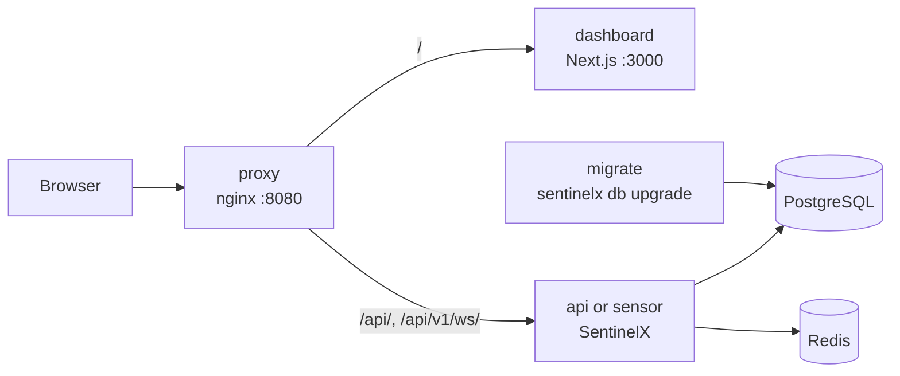
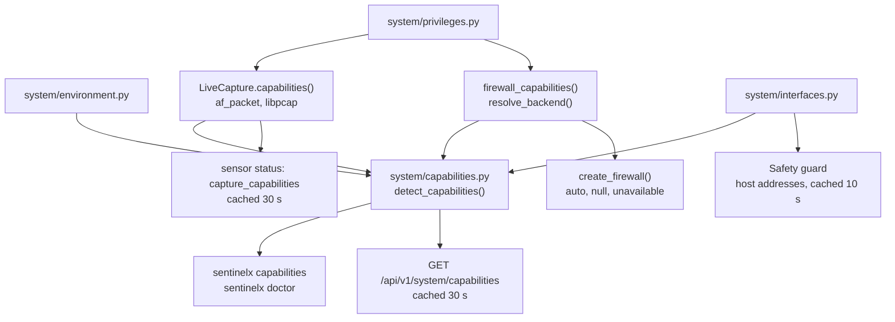

# Architecture

This document describes how SentinelX is put together: the process layout, how a packet becomes a detection and possibly a firewall change, how the platform finds out what the host can do, where state lives and how it is bounded, and the design decisions and limitations that follow from those choices. It is written for operators who need to reason about behaviour under load and for contributors who need to know where code belongs.

## System overview

SentinelX is a modular monolith. The Python package `packages/sentinelx` holds the detection core, storage, the HTTP/WebSocket API and the CLI. The Next.js dashboard in `apps/dashboard` is a separate process that talks to the API. The browser always talks to one origin, so the API's `SameSite=Strict` session cookies work without cross-origin requests:

- **Development.** The dashboard server rewrites `/api/*` to `SENTINELX_API_URL` (default `http://127.0.0.1:8000`). The browser opens the event stream at `/api/v1/ws/events` on the page's own origin (`location.host`), and the dashboard server forwards it. `/runtime-config` can override the WebSocket base URL with `SENTINELX_PUBLIC_WS_URL`, which is unset by default.
- **Docker Compose.** A front proxy (the `proxy` service, `nginxinc/nginx-unprivileged` with `docker/proxy/default.conf.template`) is the only published browser entry point, on `127.0.0.1:${DASHBOARD_PORT:-3000}`. It sends `/api/v1/ws/` (with the WebSocket upgrade, 1-hour timeouts) and `/api/` to the API upstream `SENTINELX_API_UPSTREAM` (default `api:8000`; `host.docker.internal:8001` for the host-network sensor), and everything else to the dashboard. It returns 404 for `/api/v1/metrics`, streams uploads to the API without buffering, and limits request bodies to `SENTINELX_MAX_UPLOAD_MB`. The dashboard, REST API and event stream therefore share one origin. It appends the client address to `X-Forwarded-For`; the API believes that header only from `API__TRUSTED_PROXIES`, which Compose sets to the proxy's network (`FRONTEND_SUBNET`, default `172.31.250.0/24`). The API port is also published on `127.0.0.1:${API_PORT:-8000}` for scripts and Prometheus. Terminate TLS in front of the proxy. See [deployment.md](deployment.md) for the services, the `capture` profile and TLS.



### The composition root

`packages/sentinelx/services/platform.py` defines `Platform`, which builds every component once, in dependency order, and owns their lifecycle. The API and the CLI both construct a `Platform`:

- **API.** `sentinelx start` runs uvicorn with one worker. The FastAPI lifespan in `api/app.py` builds a `Platform` and calls `start()`; with `--capture`, `api/server.py` then starts live capture. Routes are thin: they validate input, check roles and call a service.
- **CLI.** Most commands use `platform_context()` in `cli/runtime.py`, which starts a `Platform` with background loops and bootstrap-admin creation turned off, runs the command and stops the platform. `python -m sentinelx` runs the same CLI.

The front-ends share code, configuration and the database. They do not share memory. A CLI command such as `sentinelx status` builds its own short-lived `Platform`, so it sees stored history, but not the sliding windows, open incidents or capture statistics of a server running in another process. Use the API (see [api.md](api.md)) for the live state of a running sensor. `sentinelx metrics` is the exception: it reads Prometheus metrics from a running server over HTTP.

`Platform.start()` runs these steps in order:

1. Connect to the database and check its schema (see [Database](#database)); a schema that does not match stops startup. Then connect to Redis (entering degraded mode if Redis is unreachable and not required).
2. Apply runtime setting overrides stored in the database, so components that parse settings at construction see the effective values. An explicit `RESPONSE_MODE` or `DRY_RUN` in the environment wins over a stored value for those two fields.
3. Build the local threat-intelligence service (`assembly.build_intel`, from `rules/intel/allowlist.txt` and `rules/intel/denylist.txt`), the firewall adapter (`create_firewall`) and the `Pipeline`.
4. Attach the anomaly detectors (`assembly.attach_anomaly_detectors`), give the safety guard the recently seen operator addresses, and register the settings-change listener.
5. Sync rule files into the database, attach the rule service to the detection engine and install the active rules as detectors.
6. Read the expiry times of blocks recorded as active, start the pipeline (event bus, and response engine with those expiries restored), then mark block records inactive whose network the firewall no longer holds.
7. Start the event persister, then create the sensor, replay and query services.
8. Create the first administrator if no users exist (API only).
9. Start the background loops: a `system.health` event every 5 seconds, and retention, which first runs 60 seconds after startup and then every 6 hours (API only).

`Platform.stop()` cancels the background loops, stops live capture and any running replays, waits up to 5 seconds for the event bus's handler queue to drain (so detections already published reach the persister), stops the persister (which flushes its buffer), stops the pipeline (response engine and event bus), and closes Redis and the database.

### One assembly for every pipeline

`packages/sentinelx/assembly.py` decides which detectors and intelligence a pipeline gets:

| Function | What it attaches |
|---|---|
| `build_intel(settings)` | The local allowlist and denylist providers from `<rules_directory>/intel` |
| `attach_anomaly_detectors(pipeline, settings)` | The statistical detector and, if enabled and the model loads, the ML detector, subject to `DETECTION_MODE` and `disabled_detectors` |
| `attach_file_rules(pipeline, settings)` | Every valid rule file from the rules directory, unless `DETECTION_MODE=disabled`. Used where there is no database |
| `rules_enabled(settings)` | False only for `DETECTION_MODE=disabled` |

Live capture (the platform), API and dashboard replays (`services/replay.py`), `sentinelx replay` and `sentinelx monitor` (`cli/lab.py`) and the benchmark (`bench/experiments.py`) all use these functions, so a replay runs exactly the detection a live sensor runs. The platform and API replays install rules through the rule service instead of `attach_file_rules`, so rules disabled in the dashboard stay disabled. Built-in detectors are selected by the detection engine itself. See [detection-engine.md](detection-engine.md#detection-modes).

### The security core is independent of the web layer

The packages that process traffic (`capture`, `parser`, `features`, `detection`, `signatures`, `anomaly`, `scoring`, `correlation`, `threat_intel`, `response`, `firewall`), the host-introspection package `system`, and `pipeline.py` import nothing from `api`, `cli`, `services` or `storage`. Apart from each other, they depend on `common`, `config`, `events` and `telemetry` (the rule test runner in `signatures` also uses the synthetic scenarios in `testing`). The dependency runs one way: services and front-ends use the core, and the core does not know they exist.

`assembly.py` sits between the core and the front-ends. It depends on the core; `attach_file_rules` also imports `max_rule_window` from `services/rules.py` when it is called.

In practice this means:

- `Pipeline` can be driven directly from a test, the benchmark harness or a script, with no database, Redis or HTTP server.
- Persistence and the dashboard are event-bus subscribers. If nothing subscribes, the pipeline still runs.
- The response engine receives the audit sink as a callable, so it does not import storage.

## Platform capabilities

Everything platform-specific that the rest of SentinelX needs to know lives in `packages/sentinelx/system/`, so detection, scoring and response contain no operating-system checks:

| Module | Answers |
|---|---|
| `environment.py` | Operating system, architecture, Python version, WSL version, container type (`docker`, `podman`, `kubernetes`, ...), detected from files and environment variables. Cached for the process |
| `privileges.py` | Can this process capture (a real `AF_PACKET` socket on Linux, `/dev/bpf*` access on macOS, Npcap on Windows)? Can it change the firewall (root or `CAP_NET_ADMIN` that can be passed to child processes on Linux, root on macOS, elevation on Windows)? Is libpcap installed? It also raises `CAP_NET_ADMIN` into the ambient set before firewall commands run |
| `interfaces.py` | Interfaces with addresses, state and counters, from `psutil`; `cached_local_addresses()` re-reads host addresses at most every 10 seconds |
| `capabilities.py` | The combined report: detection engine, PCAP replay, interface enumeration, packet capture, live capture, firewall control, automatic blocking and privileged access, each with a reason and a remedy |

The capability flow:



The same probes decide behaviour, not only reports: `LiveCapture` opens the backend `auto` selects, `create_firewall` resolves `FIREWALL_BACKEND=auto` to the first usable backend and returns a refusing adapter when none can run, and the safety guard refuses to block when host addresses cannot be enumerated. Probing opens a raw socket and inspects firewall tooling, so the platform report is computed in a worker thread and cached for 30 seconds, and the sensor caches its live-capture report for 30 seconds.

## Packet-to-response data flow

Every source of packets (live interface, PCAP file, in-memory frames) is driven through the same `Pipeline` class in `packages/sentinelx/pipeline.py`. There is no second code path for replay or tests.

```mermaid
flowchart TD
    CAP["Capture<br/>live AF_PACKET / libpcap, PCAP file, mock"] -->|RawFrame| DEC["Decoder<br/>parser/decoder.py"]
    DEC -->|PacketEvent| FEAT["Feature extractor<br/>per-source profiles, flows"]
    FEAT -->|FeatureContext| DET

    subgraph DET["Detection engine"]
        BUILTIN["Built-in detectors"]
        RULES["Rule detectors<br/>YAML rules"]
        ANOM["Anomaly detectors<br/>statistical, optional ML"]
        POLICY["Evidence check, allowlist,<br/>cooldown, capture-time stamp"]
        BUILTIN --> POLICY
        RULES --> POLICY
        ANOM --> POLICY
    end

    DET -->|Detection| INTEL["Threat intel lookup"]
    INTEL --> RISK["Risk engine<br/>0-100 score with rationale"]
    RISK --> CORR["Correlation engine<br/>detections into incidents"]
    CORR --> RESP["Response engine"]
    RESP --> GUARD["Safety guard"]
    GUARD --> FW["Firewall adapter<br/>nftables, iptables, pf, Windows Firewall,<br/>memory, null"]
    RESP -. queue .-> WH["Webhook worker"]

    RISK -. detection.created .-> BUS(("Event bus"))
    CORR -. incident.opened / updated .-> BUS
    RESP -. response.decided, pending_approval .-> BUS
    RESP -. ip.blocked / ip.unblocked .-> BUS
    BUS --> PERS["Event persister<br/>batched database writes"]
    BUS --> WS["WebSocket hub<br/>/api/v1/ws/events"]
    RESP -->|audit sink, direct write| DB[("Database")]
    PERS --> DB
```

### Stage by stage

| Stage | Code | What happens |
|---|---|---|
| Capture | `capture/` | A `PacketCapture` yields `RawFrame` objects: bytes, timestamp, per-frame link type, interface and wire length. Live capture uses AF_PACKET or libpcap; files are read by SentinelX's own pcap/pcapng reader. See [packet-capture.md](packet-capture.md). |
| Decode | `parser/decoder.py`, `parser/layers.py`, `parser/application.py` | Link, network and transport headers are decoded with `struct`. DNS, HTTP and TLS metadata is added for well-known ports. The result is a `PacketEvent`, or `None` for a frame that cannot be decoded (counted, never raised). |
| Features | `features/extractor.py`, `features/profiles.py` | One `SourceProfile` per source address and one `FlowState` per canonical flow are updated once per packet, and profiles are expired to the packet's time before detectors read them. Detectors read a `FeatureContext` instead of keeping their own counters. |
| Detect | `detection/engine.py` | Every enabled detector runs against the context. Built-in detectors, rule detectors (`signatures/detector.py`, one per enabled rule) and anomaly detectors are all `Detector` instances in the same engine. The engine then applies shared policy: detections without evidence are rejected, allowlisted sources are suppressed, and repeats of the same (detector, source) pair are suppressed for `detection_cooldown_seconds` unless severity rises or confidence rises by at least 0.2. Admitted detections are stamped with the capture time of the triggering packet. See [detection-engine.md](detection-engine.md) and [rule-engine.md](rule-engine.md). |
| Threat intel | `threat_intel/providers.py` | Only when a detection exists. The source address is checked against every configured provider, each bounded by a 2-second timeout. An allowlist verdict marks the source as trusted; otherwise the highest reputation score wins. |
| Score | `scoring/engine.py` | The risk engine computes an additive, clamped 0-100 score from severity, confidence, frequency, history, intel, correlation (the number of other detectors already in this source's open incident or pending group) and target sensitivity. Frequency and history windows use detection (capture) time. See [risk-scoring.md](risk-scoring.md). A `detection.created` event is published here. |
| Correlate | `correlation/engine.py` | Detections are grouped by source (optionally also by destination). An incident opens when enough distinct detectors agree within the window, or immediately for a critical detection above `standalone_risk_threshold`. Windows are measured in capture time. `incident.opened`, `incident.updated` and `severity.changed` events are published. |
| Respond | `response/engine.py`, `response/safety.py`, `firewall/` | The response engine records an alert and, if configured, queues a webhook. For a preventive recommendation at or above `auto_block_threshold`, it applies the `RESPONSE_MODE` and `DRY_RUN` decision matrix. Anything that would change the firewall passes the safety guard first. The incident response is re-evaluated when an incident is created, rises in severity, or its risk crosses the threshold; its sources are then considered for a temporary block. See [response-engine.md](response-engine.md). |
| Publish and persist | `events/bus.py`, `storage/persister.py`, `api/websocket.py` | Subscribers receive events through bounded queues. The persister writes detections, incidents, response decisions, blocks and per-minute traffic summaries. WebSocket clients receive the events their role allows. Events from a replay carry its `replay_id`. |

The order in the code is threat intel, then risk scoring, then correlation. Intel runs before scoring because the intel verdict is one of the score's inputs.

Decode, feature extraction and detection are synchronous and do no I/O. The pipeline switches to asynchronous work (intel, publishing, response, firewall) only when a detector fires.

## Package map

| Package | Responsibility |
|---|---|
| `anomaly` | Statistical baselining of network-wide metrics (EWMA, `statistical.py`) and the optional Isolation Forest detector with dependency and model loading checks (`ml.py`; needs the `ml` extra). |
| `api` | FastAPI application factory, routes under `/api/v1`, authentication and rate-limit middleware, trusted-proxy client address resolution, error mapping, the `/api/v1/ws/events` WebSocket, and the ASGI entry that starts capture with `--capture` (`server.py`). |
| `assembly.py` | The detectors and intelligence every pipeline gets: anomaly detectors, file rules and local threat intelligence. |
| `bench` | Benchmark experiments used by `scripts/benchmark.py`. See [benchmarking.md](benchmarking.md). |
| `capture` | Packet sources: the `PacketCapture` base class with `CaptureStats` and `CaptureCapabilities`; `live.py` (backend selection), `afpacket.py` (Linux AF_PACKET), `libpcap.py` (Scapy sniffer on Linux, macOS and Windows), `pcap.py` and `pcapfile.py` (file replay and the pcap/pcapng reader), `mock.py`, and the source factory. |
| `cli` | The `sentinelx` Typer application, split into operate, investigate, respond, lab and configure command groups. |
| `common` | Shared models (`PacketEvent`, `Detection`, `Incident`), enums, errors, IP address handling and the sliding-window primitives in `windows.py`. |
| `config` | Typed settings (`settings.py`) loaded from environment variables and `.env`, including the safety banner. |
| `correlation` | Folds detections into incidents using ordered kill-chain patterns. |
| `detection` | The detection engine and built-in detectors: scanning, brute force, floods, DNS, TCP flag anomalies and the denylist. |
| `events` | The in-process event bus and event payload serialisation. |
| `features` | Per-source profiles, per-flow state and the feature extractor. |
| `firewall` | Backend selection (`auto`), adapters for nftables, iptables, pf and Windows Firewall, the in-memory simulator, the refusing `null` and unavailable adapters, and a command runner that never uses a shell. |
| `parser` | Link, network and transport decoding (`layers.py`), DNS, HTTP and TLS metadata (`application.py`) and the decoder that produces `PacketEvent` (`decoder.py`). |
| `pipeline.py` | The `Pipeline` class that connects every stage, plus `RunReport` with measured run statistics. |
| `response` | The response engine (decision matrix, block registry, pending approvals, block expiry, webhook worker) and the safety guard. |
| `scoring` | The risk engine. |
| `services` | Application services over the core: `platform.py` (composition root), authentication, runtime configuration, rules, sensor control, PCAP replay, read models for the API and CLI, and `diagnostics.py` (`sentinelx doctor`). |
| `signatures` | The YAML rule format and its restricted loader, the expression language, the rule detector and the rule test runner. |
| `storage` | SQLAlchemy models and repositories, the async database wrapper with startup schema checks, Alembic migrations and `migrate.py`, the event persister, the audit service and Redis-backed shared state. |
| `system` | Host introspection: environment, privileges, interfaces and the capability report. |
| `telemetry` | Structured logging with secret redaction, and Prometheus metrics. |
| `testing` | Synthetic traffic scenarios with parameter validation, and PCAP helpers used by tests, benchmarks, fixtures and the rule runner. |
| `threat_intel` | Reputation providers (local allowlist and denylist files, an optional HTTP provider) and verdict merging. |

## Concurrency model

A SentinelX server is one Python process with one asyncio event loop. The pipeline, the API, the WebSocket hub, the persister and the background loops all run on that loop. Capture reads, probes and some file operations run in worker threads.

### Pipeline

- `Pipeline.run()` iterates over a capture source and calls `process_frame()` for each frame. Frames are processed one at a time, in order. There is no parallel packet processing.
- Per-packet work (decode, features, detection) is synchronous CPU work on the event loop. While a frame is being processed, no other coroutine runs.
- The loop gets a chance to run other tasks between batches of frames. Live AF_PACKET capture reads up to 512 frames per `asyncio.to_thread` call. The libpcap backend's sniffer thread hands frames to the loop through a bounded queue and yields every 256 frames during a burst. PCAP replay reads frames synchronously and yields to the loop whenever it has run for more than 5 ms, so a replay at full speed does not starve the API.
- Threat-intel lookups (each provider bounded by a 2-second timeout) and firewall commands (subprocesses with a timeout) are awaited inline, before the pipeline takes the next frame. Webhooks are not: they go on a bounded queue of 200 and a separate worker delivers them.
- Firewall changes made by the response engine are serialised by an `asyncio.Lock`. A separate reaper task checks for expired temporary blocks every 5 seconds and takes the same lock for each removal.
- Live capture runs as a background task owned by `SensorService`, which keeps only the most recent 500 detections and incidents of the run in memory (`max_results`; counts stay complete). Each PCAP replay started from the API runs as its own task with its own `Pipeline` instance (separate windows, incidents and anomaly baselines, and a forced dry-run in-memory firewall). Replays share the process, the event loop and the event bus with live capture. At most two replays run at once.
- Platform health is cached for 3 seconds, because the unauthenticated liveness endpoint, the dashboard and the 5-second health loop all read it and each fresh check queries the database, Redis and the firewall. The capability report is cached for 30 seconds.

### Event bus

`events/bus.py` implements an in-process fan-out bus. `Platform` creates it with a queue size of 5,000.

- **Pull subscribers** (`subscribe()`, used by the WebSocket hub and the CLI monitor) each get their own bounded queue. When a subscriber's queue is full, the event is dropped for that subscriber only and counted. Publishing never waits for a subscriber.
- **Push handlers** (`add_handler()`, used by the persister) share one bounded handler queue that a single worker task drains, running handlers one after another. If that queue is full, the event is dropped for all handlers and a `event_handler_queue_full` warning is logged.
- Handler exceptions are logged, counted in `sentinelx_event_handler_failures_total{handler}`, and do not stop the worker.
- Drops are counted in `sentinelx_events_dropped_total{target="subscriber"|"handlers"}`.
- `EventBus.drain()` waits until every queued handler event has been processed. `Platform.stop()` calls it (5-second limit, `event_bus_drain_timeout` logged when exceeded) before stopping the persister. When the bus stops, subscriber iterators end instead of waiting forever.
- `EventBus.stats()` reports `published`, `dropped`, `subscribers`, `handlers` and `handler_backlog`. The handler backlog is also exported as a metric by the health check.

WebSocket connections use a per-connection queue of `api.websocket_max_queue` (default 500). The server sends a ping every 25 seconds, and a client whose send stalls for 10 seconds is disconnected.

This design gives priority to packet processing over event delivery. A slow dashboard loses events. It does not slow detection.

### Persister

`storage/persister.py` registers as a bus handler for detections, incidents, response decisions, block and unblock events, and packet statistics.

- Events are buffered and written in one transaction when the buffer reaches `storage.batch_size` (default 200) or every `storage.flush_interval_seconds` (default 2.0), and once more when the persister stops.
- A failed batch is logged, counted in `failed_batches` and in the `storage_errors` metric, and discarded. Later batches are still written. The platform health status reports the persister as not OK once any batch has failed.
- A flush triggered by a full buffer runs inside the handler worker. While the database write is in progress, other events wait in the handler queue. A database that stays slow for long enough fills that queue, and events are then dropped as described above.
- Detections are de-duplicated by `detection_id` before insert. Replay detections, incidents and response decisions are stored with their `replay_id`.
- Packet statistics from live capture are rolled into one traffic summary and one system-metric row per wall-clock minute. Replay statistics are not stored as traffic history.

Audit records do not travel through the bus. `storage/audit.py` writes them straight to the database, because dropping events is acceptable for dashboard updates and not for an audit trail.

## State and memory bounds

All traffic state is held in memory inside the sensor process. Every structure that grows with traffic has a limit, because an intrusion detection system is itself a target for resource exhaustion: traffic from a very large number of spoofed sources would otherwise create one profile per source until memory runs out.

### Feature extractor eviction

`features/extractor.py` keeps a dictionary of source profiles and a dictionary of flows.

| Limit or rule | Value |
|---|---|
| Tracked sources | `detection.max_tracked_sources`, default 50,000 (minimum 100) |
| Tracked flows | 4 times the source limit (200,000 by default) |
| Periodic sweep | Every 2,048 packets |
| Flow idle timeout | 120 seconds without a packet |
| Profile expiry in the sweep | Not seen for 2 times the feature window |
| Feature window | The longest detector window; 60 seconds with default settings (`brute_force_window_seconds`) |

When a new source arrives and the source limit is reached, profiles not seen for one feature window are removed first. If the table is still full, the least recently seen 10% are removed. Flows are evicted the same way, using the 120-second idle timeout. Every eviction is counted in `evicted_sources` and `evicted_flows`, which appear in the pipeline status (`GET /api/v1/system/status`, under `pipeline.features`), so you can distinguish a quiet network from a sensor that is shedding state.

Timestamps used for windows and expiry are packet timestamps, not the wall clock. Replaying a capture therefore produces the same windows as the original traffic. Before detectors read a profile, its windows are expired to the current packet time, so a profile that has been quiet does not report activity that has left its window.

Changing any detector window setting at runtime replaces the feature extractor, which discards all traffic state. A warning (`feature_windows_rebuilt`) is logged when this happens.

### Window structures

`common/windows.py` provides the primitives that profiles are built from. Each operation that runs per packet is O(1), amortised O(1) or O(log n):

| Structure | Used for | Cost per operation | Hard cap |
|---|---|---|---|
| `SlidingWindow` | Time-ordered entries | Amortised O(1) add and expire | 100,000 entries |
| `TimeSeriesCounter` | Event counts (SYNs, connections, DNS queries) over several trailing windows | Amortised O(1) for each registered duration, which keeps its own head pointer; O(log n) (bisect) for other cutoffs | 200,000 entries |
| `SizeWindow` | Packet sizes | O(1) running mean and standard deviation | 100,000 entries |
| `DistinctWindow` | Distinct values (DNS names, HTTP paths) | Amortised O(1) distinct count using a running `Counter` | 100,000 entries |
| `UniqueWindow` | Distinct destination ports and hosts per key | Amortised O(1), built on `DistinctWindow` | `max_keys` per instance; drops empty windows, then the oldest-inserted half |
| `CounterWindow` | Per-key counts | Amortised O(1) | 50,000 keys by default |
| `EwmaBaseline` | Anomaly baselines | O(1) update, no history kept | Not applicable |

`TimeSeriesCounter` clamps out-of-order timestamps (common in merged captures) to the newest timestamp seen. This keeps its list sorted at the cost of some timing precision.

### Why this matters for security

If per-packet cost grows with the amount of state in a window, an attacker can slow the sensor just by sending more traffic, and a slowed sensor drops packets. The `DistinctWindow` docstring records the case that motivated this design: an earlier implementation rebuilt a set of the whole window on every packet, and a single source sending 300 packets per second made processing roughly six times slower. `tests/unit/test_windows.py` compares per-packet cost at different window sizes, so a change that reintroduces cost proportional to window contents fails the tests.

The same reasoning applies elsewhere in the decoder: the DNS name reader follows at most 64 labels and never visits the same compression pointer twice, VLAN tag and IPv6 extension-header walks are bounded, and application parsers scan at most 4,096 bytes of payload. The capture file reader validates every length field against fixed maxima before reading, and rule YAML is parsed without aliases and with bounded nesting. See [packet-capture.md](packet-capture.md).

### Other bounded structures

| Component | Bound |
|---|---|
| Detection cooldown table | Pruned to entries inside the cooldown once it exceeds 100,000 entries |
| Risk engine source history | 50,000 sources; the oldest-inserted 10% are dropped when full. At most 500 recent detections per source |
| Correlation: open incidents | At most `correlation.max_open_incidents` (default 1,000); the one with the oldest `last_seen` stops correlating when a new one is needed |
| Correlation: per incident | Members, timeline entries and `detection_ids` capped at 1,000 each (the highest-risk member is always kept); `detection_total` keeps the true count. Affected sources, destinations and services capped at 1,000 each |
| Correlation: pending groups | Detections waiting for corroboration are dropped when they fall outside `correlation.window_seconds`; groups with nothing left inside the window are swept every 30 seconds of capture time |
| Live capture run report | The most recent 500 detections (trimmed when 1,000 accumulate) and 500 incidents |
| Response engine decision history | The oldest 1,000 dropped when it exceeds 5,000 entries |
| Pending approvals | 1,000 actions, each for at most 24 hours |
| Webhook queue | 200 queued deliveries; further webhooks are dropped and counted |
| Operator addresses (safety guard) | 1,024 addresses, each remembered for one hour |
| Capture hand-off queue (libpcap backend) | `capture.queue_size`, default 20,000 frames; overflow counted in `dropped_queue` |
| Redis fallback rate-limit windows | Cleared when more than 100,000 keys exist |
| `RunReport` latency samples | At most 2,000,000 per run |

## Storage

### Database

`storage/database.py` wraps a SQLAlchemy async engine.

| | SQLite | PostgreSQL |
|---|---|---|
| Intended use | Development and evaluation with no infrastructure | Production |
| Driver | `aiosqlite` | `asyncpg` |
| Schema at startup | A database file is migrated to the latest Alembic revision automatically. A file created before migrations were tracked (it has tables but no `alembic_version`) is stamped at the first revision and then upgraded. An in-memory database gets tables created from the models | Never changed automatically. Startup refuses a schema that is not at the latest revision: `database schema is at revision <applied> but this version of SentinelX needs <head>; run: sentinelx db upgrade` |
| Connection settings | 30-second busy timeout, `PRAGMA foreign_keys=ON`, `PRAGMA journal_mode=WAL` | Pool of `storage.pool_size` (default 10) plus `storage.max_overflow` (default 20) |
| Production | Refused when `ENVIRONMENT=production` | Required |

The schema check runs before anything is written, in the API server and in every CLI command that starts a platform, so a server never runs against a schema that would lose writes.

`DATABASE_URL` (or `STORAGE__DATABASE_URL`) accepts the forms most providers issue: `postgres://` and `postgresql://` are rewritten to `postgresql+asyncpg://`, and `sqlite://` to `sqlite+aiosqlite://`. The default is `sqlite+aiosqlite:///./sentinelx.db`. Connection errors name the host but never the password.

Tables: `users`, `refresh_tokens`, `incidents`, `detections`, `response_actions`, `blocked_sources`, `audit_events`, `rules`, `settings`, `traffic_summaries`, `system_metrics` and `replays`.

Migrations live in `packages/sentinelx/storage/migrations`. `storage/migrate.py` configures Alembic programmatically, so no `alembic.ini` is needed at runtime; the `alembic.ini` at the repository root is for developers running `alembic` directly. Related commands:

| Command | Purpose |
|---|---|
| `sentinelx db upgrade` | Apply migrations (required for PostgreSQL before first start; the Docker Compose stack runs it in the `migrate` service). |
| `sentinelx db current` | Show the applied and latest migration revisions. |
| `sentinelx db purge` | Apply retention policies now. |
| `sentinelx doctor` | Among other checks, reports whether the database schema is at the latest revision. |

Retention is controlled by `storage.retention_days` (default 30; flat alias `RETENTION_DAYS`), `storage.audit_retention_days` (default 365) and `storage.metrics_retention_days` (default 7). Detections are purged by their timestamp, which is capture time, so detections from a replay of an old capture are removed at the next retention run if the capture is older than `retention_days`.

Runtime setting changes made with `sentinelx config set` or the API are stored in the `settings` table and applied at the next startup, where they take precedence over environment variables, except `response.mode` and `response.dry_run`, where an explicit environment value wins.

See [deployment.md](deployment.md) for production database setup.

### Redis

`storage/redis_state.py` (`SharedState`) holds state that needs to be shared between processes: API request rate limits, login throttling, single-use WebSocket tickets and short-lived caches. Rate limits use a sliding window stored in a Redis sorted set.

Per-packet detection state is never stored in Redis. A network round trip per packet would limit the sensor to a few thousand packets per second, so windows stay in process (see above).

**Degraded mode.** With `storage.redis_required` false (the default), an unreachable Redis does not stop the platform:

- A warning `redis_unavailable_degraded_mode` is logged once.
- Rate limits, tickets and caches fall back to in-process structures, so limits apply per process instead of globally.
- A failed operation on a connected client also switches to degraded mode.
- Reconnection is attempted on use, at most every 30 seconds. Recovery is logged as `redis_recovered`.
- Platform health reports `redis.degraded: true`, and the overall status becomes `degraded` (not `error`). `sentinelx doctor` reports it as a warning.

With `STORAGE__REDIS_REQUIRED=true`, startup fails if Redis is unreachable, and later Redis errors raise instead of degrading.

`SharedState` also implements publish and subscribe, but no component currently uses them. Events are not fanned out between processes.

## Key design decisions and trade-offs

**Modular monolith rather than services.** One process and one deployable unit keep operations simple, and a detection reaches the response engine without a network hop. The cost is that scaling is vertical, and every component shares one event loop and one CPU core.

**One pipeline and one assembly for live traffic, replay, benchmarks and tests.** A detection that fires on a replay went through the same code, with the same detectors, as it would on the wire, and benchmarks measure production code. The cost is that the pipeline cannot use shortcuts that only make sense for one of those uses.

**A `struct`-based decoder and file reader instead of Scapy objects.** Scapy allocates a Python object per layer per packet. The SentinelX decoder was measured at roughly two times faster than Scapy `Ether(bytes)` (see [benchmarking.md](benchmarking.md)). SentinelX also reads pcap and pcapng itself, because per-interface link types, nanosecond timestamps and length validation needed to be exact. The cost is maintaining a decoder and reader that cover fewer formats and protocols than Scapy. Scapy is still used for compiling BPF filters and for the portable libpcap live-capture backend.

**Probe the host instead of assuming it.** Capture and firewall support are decided by opening a raw socket, checking capability bits, device permissions or elevation, and looking for tools, and each result carries a reason and a remedy. The cost is a probe that takes about a second the first time in a process, which is why its results are cached.

**Detection windows in process, shared state in Redis.** Keeping windows in memory avoids a round trip per packet. The cost is that detection state is per sensor process and is lost on restart.

**Drop events instead of applying back-pressure.** Slow subscribers lose events so that packet processing continues. The cost is that, under sustained load or a slow database, stored history and the dashboard can miss events. Drops are counted, and the handler queue is drained on a clean shutdown.

**Audit writes bypass the bus.** Audit records are written directly to the database so they cannot be dropped the way dashboard events can. A failed audit write by an administrative action returns an error. A failed audit write by the engine is logged at error level but does not reverse a firewall change that has already been made.

**Packet time, not wall-clock time.** Windows, detection timestamps, risk history and correlation windows use capture timestamps, which makes replay faithful: a replay reproduces the original timeline whatever its speed. For live AF_PACKET capture, the timestamp is taken when the worker thread receives the frame, so any delay before the read shifts it. The cost is that a replay of an old capture is filed in the past (see [Database](#database) for retention).

**Bounded state with eviction.** The sensor stays within a predictable amount of memory under source floods. The cost is that an attacker who creates enough sources can push a real attacker's profile out of the table before a threshold is reached, and that a very long incident keeps only its most recent members. Eviction counters and `detection_total` make this visible.

**Cooldown per (detector, source).** One port scan produces one detection, not thousands. The record escalates when severity rises or confidence rises by at least 0.2. The cost is that detail from repeat activity inside the cooldown is not recorded as separate detections.

**Additive, explainable risk score.** Every point in the score can be traced to a named factor and re-weighted in configuration. The cost is that it cannot model interactions between factors the way a learned model could. See [risk-scoring.md](risk-scoring.md).

**Safe response defaults that fail loudly.** `RESPONSE_MODE=detect_only` and `DRY_RUN=true` mean a new installation never modifies traffic. Turning dry run off or enabling automatic enforcement at runtime requires an explicit confirmation phrase, and a missing or unusable firewall refuses every change rather than reporting it as done. See [response-engine.md](response-engine.md) and [security.md](security.md).

## Known limitations

- **Throughput.** Processing is single-threaded Python. The benchmark measured roughly 2,900 to 4,600 packets per second for the full pipeline on one core of an Intel Core i5-8350U, using in-memory frames, so capture cost is not included. That is adequate for a home network, lab, small office uplink or offline PCAP analysis, and not for multi-gigabit or sustained multi-hundred-megabit links. Live-capture throughput and drop rate under load have not been measured. See [benchmarking.md](benchmarking.md).
- **One process per sensor.** `sentinelx start` runs a single uvicorn worker. Running several workers would create several independent pipelines with separate state. Scaling out means running more sensors, not more workers.
- **Per-sensor, in-memory state.** Sliding windows, baselines, cooldowns, risk history, open incidents and pending approvals live in the sensor process. They are lost on restart, and they are not shared between sensors. Several sensors can write to one database (rows carry a `sensor` column), but correlation and scoring do not span sensors.
- **CLI commands do not see live server state.** They build their own platform instance. Use the API for the running sensor's status.
- **Inline I/O on the detection path.** Threat-intel lookups and firewall commands are awaited before the next packet is processed.
- **Event loss under load.** A slow WebSocket client, a full handler queue or a failed database batch loses events for that consumer. Detection itself is not affected.
- **No stream reassembly or IP defragmentation.** HTTP and TLS metadata is read only from the segment that starts a message or handshake. Encrypted traffic yields only handshake metadata. Known decoder gaps are listed in [packet-capture.md](packet-capture.md#known-decoder-limitations).
- **Threshold evasion.** Activity spread out so that it never exceeds a threshold within a window (slow scans, low-rate brute force) is not detected by the threshold detectors. The benchmark includes these misses on purpose.
- **Eviction under source floods.** See [State and memory bounds](#state-and-memory-bounds).
- **Redis degraded mode** makes rate limits and WebSocket tickets per-process until Redis returns.
- **Platform coverage.** Live capture works on Linux (AF_PACKET or libpcap) and on macOS and Windows through libpcap (BPF devices, Npcap); it has been verified on Linux only. Enforcement with nftables and iptables has been verified on Linux with real traffic. The pf and Windows Firewall adapters are tested only against recorded command output. Under WSL, capture and firewall changes apply to the WSL virtual machine, and inside a container to the container's network namespace unless it uses host networking. PCAP replay works wherever the Python package installs.
